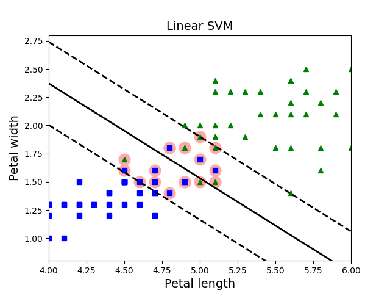

#**Machine Learning Algorithms**
Implementations of basic machine learning algorithms.
##**Algoritms**
**Supervised**
* [Linear Regression](ml_algorithms/supervised/linear.py)
* [Logistic Regression](ml_algorithms/supervised/linear.py)
* [Gradient Descent](ml_algorithms/supervised/linear.py)
* [SVM](ml_algorithms/supervised/svm.py)
* [Naive Bayes](ml_algorithms/supervised/naive_bayes.py)
* [Decision Tree](ml_algorithms/supervised/tree.py)
* [Random Forest](ml_algorithms/supervised/ensemble.py)
* [Ada Boost](ml_algorithms/supervised/boosting.py)

**Usupervised**
* [PCA](ml_algorithms/unsupervised/pca.py)
* [K-Means](ml_algorithms/unsupervised/kmeans.py)

##**Examples**

